# Lab9Web
# Lab9web
# Nama      : Abby Muhammad Titan
# Nim       : 312110546
# Kelas     : TI.21.B.1
# UNIVERSITAS PELITA BANGSA
# Pertanyaan Dan Tugas
# TUGAS MODULARISASI
#
# Langkah 1
# Menjalankan mysql server dengan aplikasi xampp, kemudian start apache dan mysql.
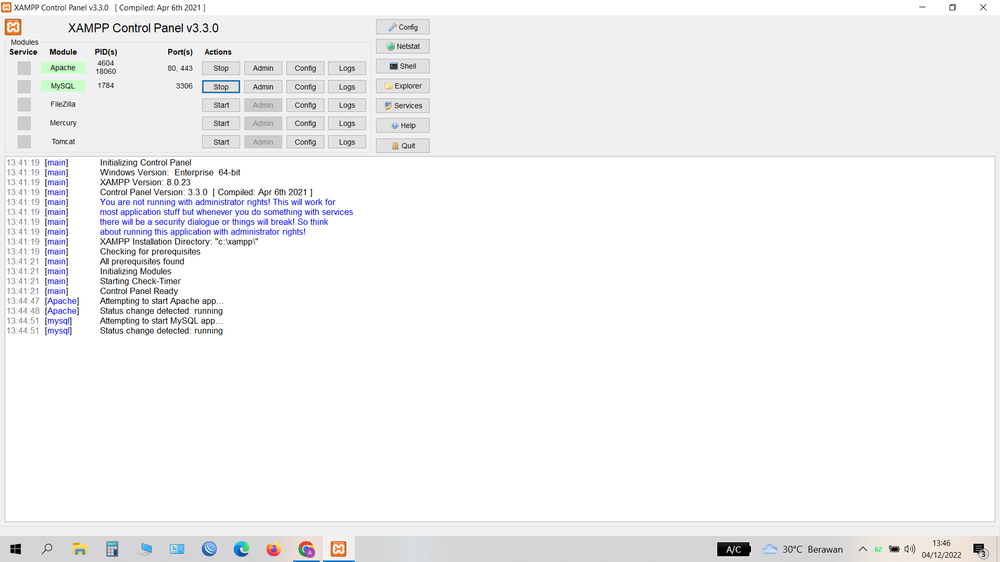
#
# Langkah 2
# Setelah itu uji coba gunakan URL :
# http://localhost/lab9_php_modular/
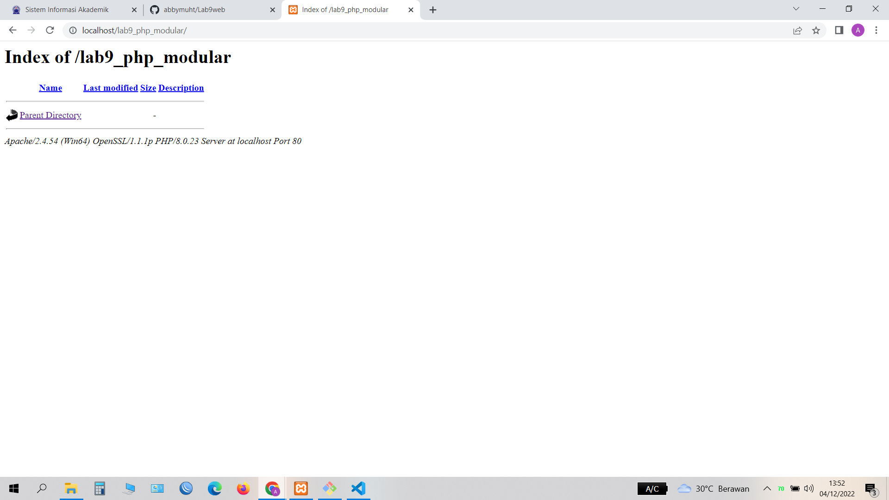

# Langkah 3
# Membuat file baru dengan nama header.php 
# Membuat file baru dengan nama footer.php 
# Membuat file baru dengan nama home.php 
# Membuat file baru dengan nama about.php 
# Hasilnya modularisasi menggunakan Require
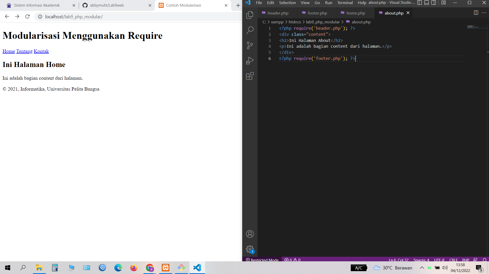
#
# Langkah 4
# PRAKTIKUM TUGAS
# Membuat file baru header.php
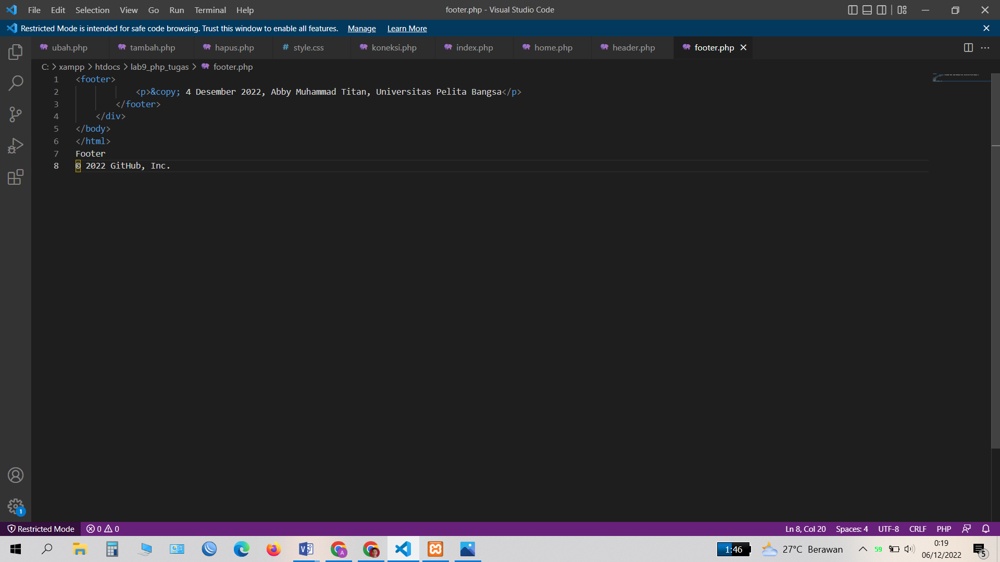
# Langkah 5
# Membuat file baru footer.php
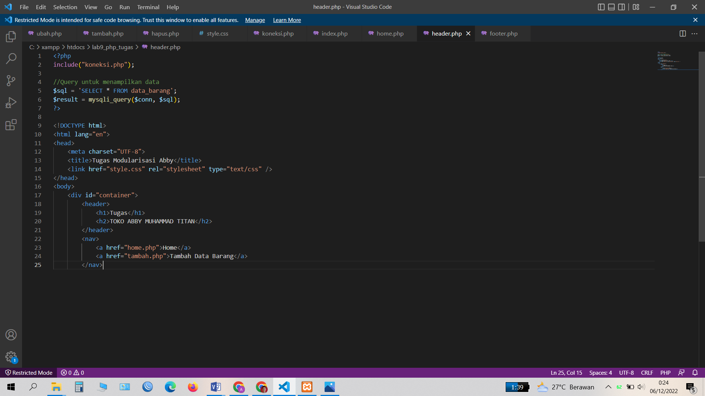
# Langkah 6
# Membuat file baru home.php
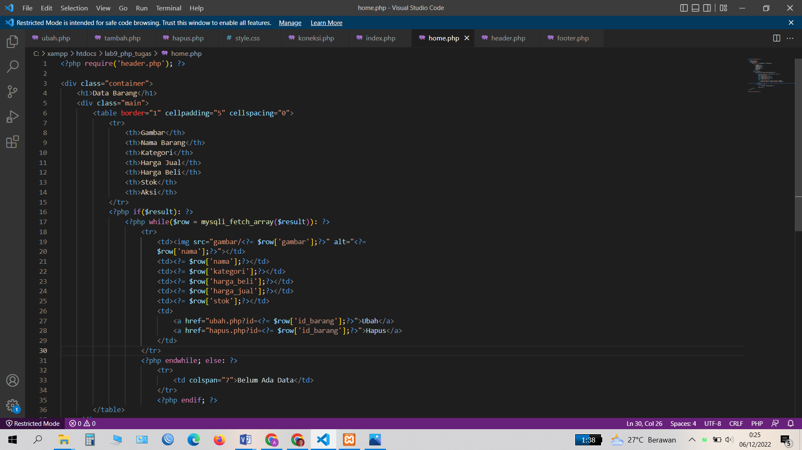
# Langkah 7
# # Membuat file baru ubah.php
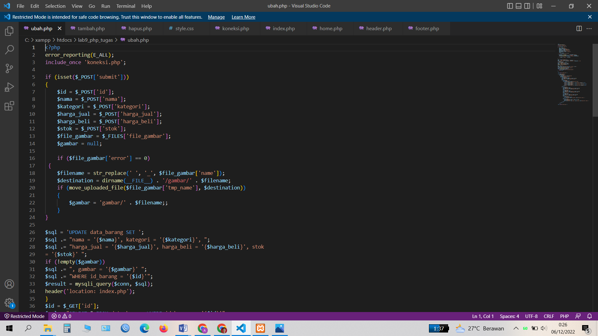
# Langkah 8
# Membuat file baru tambah.php
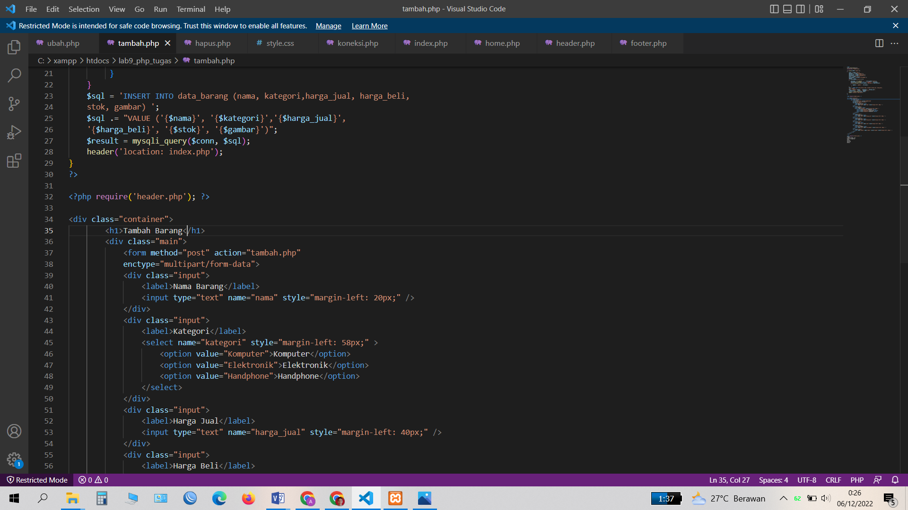
# Langkah 9
# Membuat file baru hapus.php
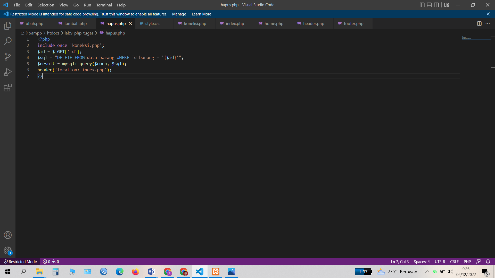
# Langkah 10
# Menambahkan css style
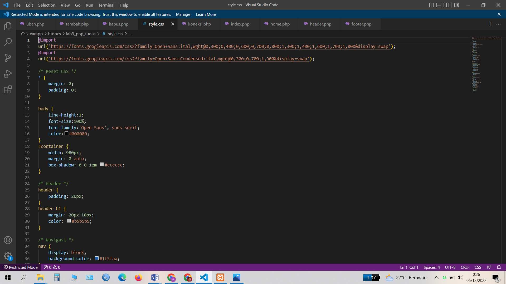
# Ini Hasil dari file tambah.php
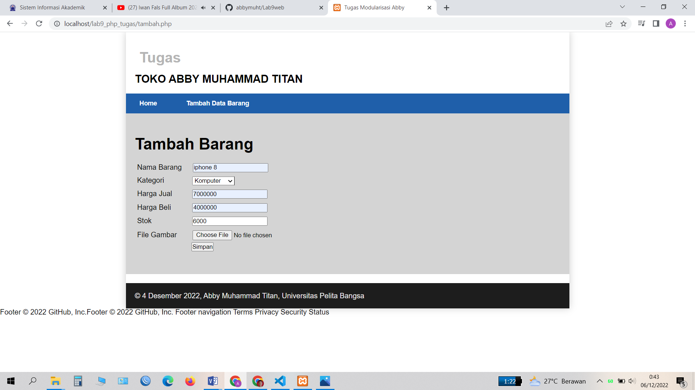
# Cukup sekian saya Abby Muhammad Titan
# Terimakasih, Semoga Bermanfaat.
# Assalamualaikum